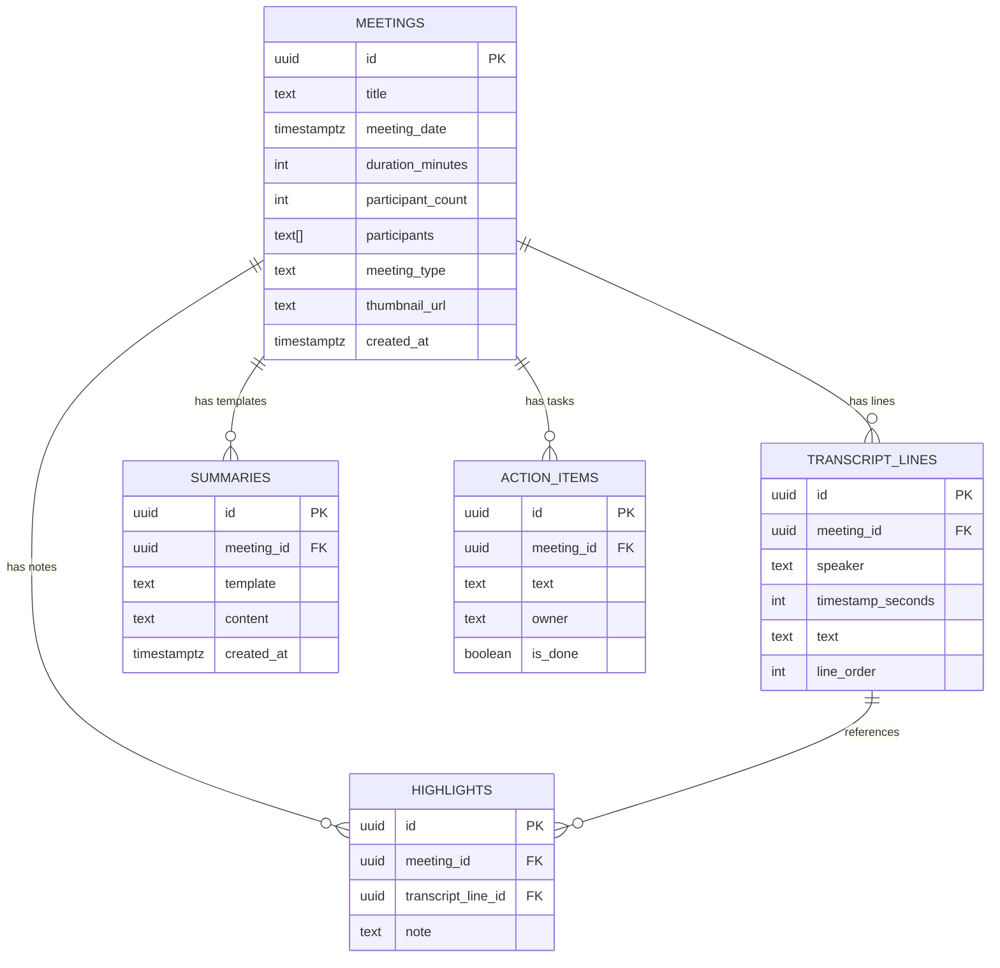

# 🌊 Fathom AI Meeting Assistant Clone

An end-to-end, high-fidelity clone of **Fathom** — the AI meeting assistant that records, transcribes, summarizes, and answers questions about video meetings.

Built with **Next.js 16 (App Router)**, **React 19**, **TypeScript**, **Tailwind CSS v4**, **Supabase (PostgreSQL + RLS)**, and **Google Gemini AI**.

---

## 🔗 Live Demo

- **App:** [https://fathom-clone-8x.vercel.app](https://fathom-clone-8x.vercel.app)
- **Repository:** [https://github.com/Alishah-Naushad/fathom-clone-8x](https://github.com/Alishah-Naushad/fathom-clone-8x)

> **Note:** The live deployment opens directly to a seeded meeting library — no sign-up or login required.

---

## 📸 Preview & Visual Aesthetics

The application faithfully replicates Fathom's signature dark-mode design language:
- **Canvas Base:** `#1a1a1a` (deep charcoal workspace)
- **Elevated Surfaces & Header:** `#212124` / `#17181c` (sleek container contrast)
- **Search & Interactive Pills:** `#2d2c31` / `#25262c`
- **Brand Accent:** `#00beff` (vibrant cyan highlights and progress indicators)
- **Subdued Meta Typography:** `#80858e` / `#6e737e`

---

## ✨ Key Features

### 1. 🗂️ Dashboard & Meeting Library (`/`)
- **Interactive Meeting Cards:** Grid of past meetings displaying custom video thumbnails, duration badges, meeting titles, formatted dates, and attendee pills.
- **Real-Time Client Filtering:** Live instant filtering across meeting titles and participant names.
- **Navigation Tabs:** Quick filtering across categories: `My Calls`, `Team Calls`, `Playlists`, `Alerts`, and `Deals`.
- **Top Navigation Bar:** Persistent global header with Fathom wave logo, universal search input, view switcher, and user avatar.

### 2. 🎬 Video Player & Timestamp Scrubbing (`/meetings/[id]`)
- **Custom Video Controls:** Smooth timeline scrubber, Play/Pause toggling, elapsed/total time readout, and volume control.
- **Variable Playback Speed:** One-click speed switcher (`1x`, `1.25x`, `1.5x`, `2x`).
- **Bidirectional Video Sync:** Scrubbing or playing the video automatically updates the current playback time used to synchronize transcripts and highlights.

### 3. 📝 Multi-Template AI Summaries (`SummaryTab`)
- **On-Demand AI Generation:** Generates and persists structured meeting notes powered by Gemini AI (`gemini-3.5-flash-lite`).
- **Dynamic Template Switcher:** Instantly switch between specialized meeting summary templates:
  - **Enhanced / General:** Meeting Purpose, Key Takeaways, Topics breakdown with sub-bullets, Next Steps.
  - **Sales Demo:** Prospect Info, Call Context, Pain Points, Specific Requirements, Objections Raised, Timeline, Next Steps, and Q&A.
  - **Engineering Standup:** Progress Updates, Current Tasks, and Impediments/Blockers per person.
  - **1:1 Check-in:** Meeting Purpose, Status & Priorities, Blockers, Discussion Topics, and Next Steps.
- **Copy & Share:** Quick copy summary markdown to clipboard.

### 4. 💬 Interactive Transcript with Synced Auto-Scroll (`TranscriptTab`)
- **Timestamp Synchronized Auto-Scroll:** As video playback progresses, the transcript automatically centers and highlights the active speaker line. Includes smart user-scroll detection that gracefully pauses auto-scrolling during manual inspection and provides a quick resume toggle.
- **Click-to-Seek:** Clicking any timestamp badge (`[MM:SS]`) instantly seeks the video to that exact second.
- **In-Transcript Search:** Real-time search query filter highlighting matching text directly within transcript dialogue lines.
- **Create Highlights & Annotations:** Highlight any spoken dialogue line and add a team note, automatically bookmarked into the meeting sidebar.

### 5. 🤖 "Ask Fathom" AI Assistant (`AskFathomTab`)
- **Grounded Q&A Chat:** Conversational AI grounded exclusively in the meeting's full transcript and structured summary.
- **Quick Prompt Chips:** One-click instant questions such as *"What were the key decisions?"*, *"List all action items & owners"*, and *"Summarize prospect objections"*.
- **Formatted Markdown Responses:** Direct answers formatted with clean bullet points and emphasis.

### 6. 📋 Action Items & Sidebar Annotations
- **Interactive Action Items:** Check off completed tasks in real time (persisted to Supabase) with assigned owner badges.
- **Quick Add Item:** Add new follow-up tasks inline directly from the meeting sidebar.
- **Highlights & Notes:** Chronological list of saved moments with timestamp jumping.

### 7. 🔍 Global Transcript & Meeting Search (`/search?q=...`)
- **Full-Text Multi-Table Search:** Search across all meeting titles, attendee names, and spoken dialogue lines simultaneously using PostgreSQL `ilike` queries.
- **Timestamped Match Snippets:** Search results display the exact matching dialogue snippet along with speaker attribution and clickable timestamp.

### 8. 🔗 Public Shareable Meeting View (`/share/[id]`)
- **Clean Read-Only Layout:** Shareable standalone link presenting meeting metadata, structured summary, and full chronological transcript without editing controls or authentication barriers.

---

## 🏗️ Architecture & Tech Stack

| Layer | Technology | Purpose |
| :--- | :--- | :--- |
| **Framework** | [Next.js 16 (App Router)](https://nextjs.org/) | React Server & Client Components, Turbopack, API Route Handlers |
| **Language** | [TypeScript 5](https://www.typescriptlang.org/) | Strict type safety across database schemas, APIs, and components |
| **Styling** | [Tailwind CSS v4](https://tailwindcss.com/) | Modern CSS variable theme tokens and utility classes |
| **Database** | [Supabase (PostgreSQL)](https://supabase.com/) | Relational database with Foreign Keys, Cascades, Indexes & RLS |
| **AI / LLM** | [Google Gemini AI](https://ai.google.dev/) | `@google/generative-ai` (`gemini-3.5-flash-lite`) with retry backoff |
| **State & Sync** | React 19 Hooks (`useState`, `useEffect`, `useRef`, `useMemo`) | Real-time video/transcript synchronization and reactive UI updates |

---

## 🗄️ Database Schema

The database is built on PostgreSQL with Row Level Security (RLS) enabled on all tables:



---

## 📁 Project Structure

```
├── .agents/                    # Agent orchestration and capture hook configuration
├── public/                     # Static assets, logos, and default meeting thumbnails
├── scripts/
│   ├── capture.py              # Session audit & capture logging script
│   └── seed.ts                 # Multi-meeting database seeder using Gemini AI
├── src/
│   ├── app/
│   │   ├── api/
│   │   │   ├── ask-fathom/     # AI meeting Q&A API endpoint
│   │   │   │   └── route.ts
│   │   │   └── summarize/      # AI meeting summary generation API endpoint
│   │   │       └── route.ts
│   │   ├── meetings/
│   │   │   └── [id]/           # Meeting Detail view (Video, Tabs, Sidebar)
│   │   │       └── page.tsx
│   │   ├── search/             # Global meeting & transcript search
│   │   │   └── page.tsx
│   │   ├── share/
│   │   │   └── [id]/           # Read-only public shareable link
│   │   │       └── page.tsx
│   │   ├── globals.css         # Tailwind v4 theme & Fathom dark mode tokens
│   │   ├── layout.tsx          # Root HTML layout & font declarations
│   │   └── page.tsx            # Dashboard / Home meeting library
│   ├── components/
│   │   ├── Header.tsx          # Universal navigation bar & search trigger
│   │   ├── Logo.tsx            # Fathom SVG brand logo + wave mark
│   │   ├── MeetingCard.tsx     # Dashboard grid meeting card component
│   │   ├── NavigationTabs.tsx  # Dashboard category filter tabs
│   │   ├── SearchBar.tsx       # Reusable search input component
│   │   ├── EmptyState.tsx      # Reusable empty data state view
│   │   ├── index.ts            # Component barrel exports
│   │   └── meeting/            # Modular meeting detail components
│   │       ├── ActionItemsSection.tsx  # Sidebar action item checklist
│   │       ├── AnnotationsSection.tsx  # Sidebar timestamped highlights
│   │       ├── AskFathomTab.tsx        # Conversational AI Q&A tab
│   │       ├── MeetingHeader.tsx       # Meeting title, date & share action
│   │       ├── SummaryTab.tsx          # Multi-template summary viewer & generator
│   │       ├── TranscriptTab.tsx       # Synced auto-scrolling transcript
│   │       ├── VideoPlayer.tsx         # Scrubbable custom video player
│   │       └── index.ts                # Meeting component barrel exports
│   └── lib/
│       ├── gemini.ts           # Gemini API client, templates & retry backoff
│       ├── supabase.ts         # Supabase public client for browser operations
│       └── supabase-admin.ts   # Supabase Service Role client for scripts/seeding
├── supabase/
│   └── schema.sql              # PostgreSQL DDL, indices, and RLS policies
├── package.json
├── tsconfig.json
└── README.md
```

---

## 🚀 Getting Started

### 1. Prerequisites
- **Node.js**: v18.18.0 or higher
- **Package Manager**: `npm`, `pnpm`, or `yarn`
- **Supabase Account**: A free Supabase project
- **Google AI Studio Key**: A free Gemini API Key from [Google AI Studio](https://aistudio.google.com/)

---

### 2. Environment Configuration

Create a `.env.local` file in the project root with the following variables:

```env
# Supabase Configuration
NEXT_PUBLIC_SUPABASE_URL=https://your-project.supabase.co
NEXT_PUBLIC_SUPABASE_ANON_KEY=your-supabase-anon-key
SUPABASE_SERVICE_ROLE_KEY=your-supabase-service-role-key

# Google Gemini AI Configuration
GEMINI_API_KEY=your-google-gemini-api-key
```

---

### 3. Database Setup

1. Open your **Supabase Dashboard** and navigate to the **SQL Editor**.
2. Copy and paste the contents of `supabase/schema.sql`.
3. Click **Run** to execute the script. This creates all necessary tables, constraints, cascade rules, indices, and RLS policies.

---

### 4. Installation & Seeding

```bash
# 1. Install dependencies
npm install

# 2. Seed realistic meetings, full-duration transcripts, summaries, and action items
npx tsx scripts/seed.ts
```

> **Note on Seeding:** The seed script uses Gemini AI to synthesize realistic multi-speaker dialogue spread accurately across each meeting's total duration (e.g., 15m, 30m, 55m), with realistic interruptions (`—`), filler words, and natural speech patterns.

---

### 5. Running the Application

```bash
# Start Next.js development server
npm run dev
```

Open [http://localhost:3000](http://localhost:3000) in your browser to view the application.

---

## 🛠️ Key Engineering Highlights

### 🔁 Resilient AI Backoff (`src/lib/gemini.ts`)
To handle Gemini API rate limits (HTTP 429) gracefully during batch seeding and real-time generation, requests pass through an exponential retry handler `withRetry` with automatic interval escalation (8s, 16s, 24s).

### ⚡ Synced Auto-Scroll Engine (`TranscriptTab.tsx`)
Transcript lines calculate their active state against the parent video's `currentTime`. Active lines scroll smoothly into view via `scrollIntoView({ behavior: "smooth", block: "center" })`. If the user manually scrolls up or down, auto-scrolling automatically disengages to prevent jarring view shifts, and displays an unobtrusive floating button to snap back to the current video time.

### 🔒 Strict Security & RLS Policies
All database tables enforce PostgreSQL Row Level Security (`RLS`). Read operations and user interaction updates (such as toggling action item completion) are securely handled with scoped policies.

---

## Scope & Deliberate Cuts

Given the assignment's time constraints, the following were intentionally out of scope:

- **No authentication or landing page.** The live link opens directly to a seeded meeting library, per the assignment's requirement that the link work for someone not signed in.
- **No live meeting bot / real video capture.** Building a bot that joins Zoom/Meet/Teams and records audio/video is a multi-week infrastructure project on its own. Instead, all 6 seeded meetings use AI-generated transcripts (via Gemini) and static thumbnail images, with a scrubbable mock video player driving transcript sync.
- Time saved on the above was reinvested into the AI summarization pipeline, multi-template switching, transcript UX, and the "Ask Fathom" Q&A feature.
- **`.agent-logs/`** — Committed logs of AI agent prompts/responses used throughout development, per assignment requirements.

---

## 📜 License

This project is created for demonstration and educational purposes as a full-featured Fathom clone. All rights to the Fathom brand and visual identity belong to Fathom.
