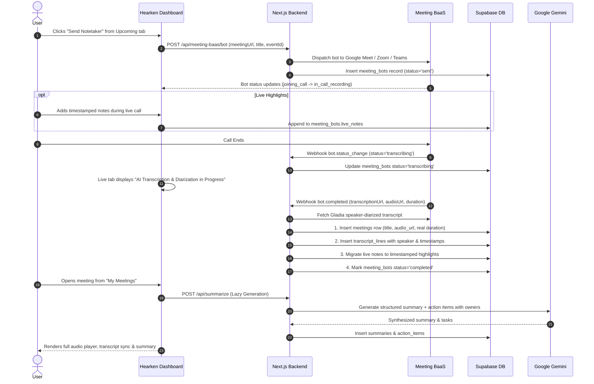
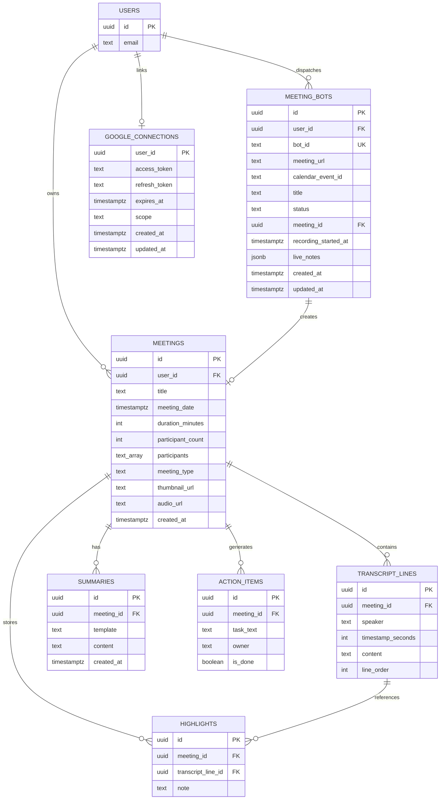

# 🎙️ Hearken — AI Meeting Note Taker

**Hearken** is a full-stack, AI-powered meeting note taker that automatically joins calls, records audio, transcribes speaker-diarized dialogue, synthesizes multi-template meeting summaries, extracts action items, and powers an interactive meeting assistant.

Built with **Next.js 16 (App Router)**, **React 19**, **TypeScript**, **Tailwind CSS v4**, **Supabase (PostgreSQL + RLS)**, **Google Gemini AI**, **Google Calendar API**, and **Meeting BaaS**.

---

## 🔗 Live Demo & Links

- **Live Application:** [https://fathom-clone-8x.vercel.app](https://fathom-clone-8x.vercel.app)
- **GitHub Repository:** [https://github.com/Alishah-Naushad/fathom-clone-8x](https://github.com/Alishah-Naushad/fathom-clone-8x)

---

## 🏛️ System Architecture


```mermaid
graph TD
    subgraph Client ["Frontend (Next.js 16 App Router + React 19)"]
        LP[Landing Page & Google OAuth]
        MM[My Meetings Dashboard]
        UM[Upcoming Meetings - Google Calendar]
        LM[Live Meeting & In-Call Notes]
        MD[Meeting Detail - Audio Player & Transcript]
        AH[Ask Hearken - Grounded AI Assistant]
        SR[Global Transcript Search]
        SH[Public Shareable View]
    end

    subgraph Backend ["Serverless API & Webhooks"]
        AuthRoute["/api/auth (Google OAuth + Supabase)"]
        CalRoute["/api/calendar (Google Calendar Sync)"]
        BotRoute["/api/meeting-baas/bot (Bot Dispatch)"]
        WebhookRoute["/api/webhooks/meeting-baas (Audio & Diarization)"]
        SummaryRoute["/api/summarize (Gemini Multi-Template Synthesis)"]
        QARoute["/api/ask-fathom (Contextual Meeting Q&A)"]
    end

    subgraph ExternalServices ["External AI & Bot Infrastructure"]
        GoogleCal["Google Calendar API"]
        MBaas["Meeting BaaS (Bot Join, Audio & Gladia Diarization)"]
        GeminiAI["Google Gemini AI (3.5 Flash Lite)"]
    end

    subgraph Database ["Supabase PostgreSQL (RLS)"]
        DB_Users[auth.users & google_connections]
        DB_Bots[meeting_bots]
        DB_Meetings[meetings]
        DB_Transcripts[transcript_lines]
        DB_Summaries[summaries]
        DB_Actions[action_items]
        DB_Highlights[highlights]
    end

    %% Client to Backend
    LP --> AuthRoute
    UM --> CalRoute
    UM --> BotRoute
    LM --> BotRoute
    MD --> SummaryRoute
    MD --> QARoute
    SR --> DB_Transcripts
    SH --> DB_Meetings

    %% Backend to External
    AuthRoute --> DB_Users
    CalRoute --> GoogleCal
    BotRoute --> MBaas
    BotRoute --> DB_Bots
    MBaas --> WebhookRoute
    WebhookRoute --> DB_Meetings
    WebhookRoute --> DB_Transcripts
    WebhookRoute --> DB_Highlights
    SummaryRoute --> GeminiAI
    QARoute --> GeminiAI

    %% Backend to Database
    SummaryRoute --> DB_Summaries
    SummaryRoute --> DB_Actions
```

---

## 🔄 Meeting Bot & Webhook Processing Pipeline


```mermaid
sequenceDiagram
    autonumber
    actor User
    participant App as Hearken Dashboard
    participant API as Next.js Backend
    participant MB as Meeting BaaS
    participant DB as Supabase DB
    participant AI as Google Gemini

    User->>App: Clicks "Send Notetaker" from Upcoming tab
    App->>API: POST /api/meeting-baas/bot (meetingUrl, title, eventId)
    API->>MB: Dispatch bot to Google Meet / Zoom / Teams
    API->>DB: Insert meeting_bots record (status='sent')
    MB-->>App: Bot status updates (joining_call -> in_call_recording)
    
    opt Live Highlights
        User->>App: Adds timestamped notes during live call
        App->>DB: Append to meeting_bots.live_notes
    end

    User->>MB: Call Ends
    MB->>API: Webhook bot.status_change (status='transcribing')
    API->>DB: Update meeting_bots status='transcribing'
    App->>App: Live tab displays "AI Transcription & Diarization in Progress"
    
    MB->>API: Webhook bot.completed (transcriptionUrl, audioUrl, duration)
    API->>MB: Fetch Gladia speaker-diarized transcript
    API->>DB: 1. Insert meetings row (title, audio_url, real duration)
    API->>DB: 2. Insert transcript_lines with speaker & timestamps
    API->>DB: 3. Migrate live notes to timestamped highlights
    API->>DB: 4. Mark meeting_bots status='completed'

    User->>App: Opens meeting from "My Meetings"
    App->>API: POST /api/summarize (Lazy Generation)
    API->>AI: Generate structured summary + action items with owners
    AI-->>API: Synthesized summary & tasks
    API->>DB: Insert summaries & action_items
    App-->>User: Renders full audio player, transcript sync & summary
```

---

## ✨ Core Features

### 1. 🌐 Landing Page & Seamless Google Authentication
- **Modern AI Aesthetic:** Vibrant electric cyan accents, glassmorphic containers, and glowing equalizer visualizers.
- **Feature Highlights:** Interactive showcases detailing automated bot recording, multi-template AI notes, speaker diarization, and grounded Q&A.
- **Google OAuth Login:** One-click Google sign-in with automatic calendar scope authorization that redirects directly into the workspace.

### 2. 📅 Google Calendar & Upcoming Meetings (`/`)
- **Automated Calendar Sync:** Fetches scheduled calls directly from Google Calendar via OAuth access tokens.
- **Dynamic Time-Based Statuses:**
  - `● In Progress` — Active calls happening right now (pulsing emerald badge).
  - `Starting Soon` — Meetings scheduled within the next 15 minutes (amber badge).
  - `Upcoming` — Scheduled future calls (indigo badge).
  - `Ended` — Past calls (muted slate badge).
- **One-Click Notetaker Dispatch:** Send Hearken's bot directly into scheduled Google Meet, Zoom, or Teams links.

### 3. 🔴 Live Meeting Recording & Highlight Capture
- **Real-Time Call Tracking:** Live elapsed timer tracking recording duration.
- **In-Call Highlights:** Take quick notes and highlights during the call with elapsed timestamp markers.
- **Transcribing Lifecycle Stage:** When the call ends, the card seamlessly transitions to an informative **Transcribing…** progress view before transferring directly to **My Meetings**.

### 4. 🗂️ My Meetings Library
- **Hearken Audio Covers:** Stylized audio recording covers with animated equalizer bars, duration tags, and formatted dates.
- **Accurate Duration Calculation:** Resolves true call length from spoken dialogue timestamps and recording metadata.
- **Instant Search Filter:** Real-time client-side search across meeting titles and participant names.

### 5. 🎧 Audio Player & Synchronized Transcript (`/meetings/[id]`)
- **Audio Recording Surface:** Scrubbable timeline player streaming from real audio recordings with animated soundwave visualizers (`voice-wave-bar`).
- **Bidirectional Playback Sync:** Scrubbing audio updates the active transcript position, and clicking any transcript timestamp seeks audio instantly.
- **Synced Auto-Scroll:** Transcript automatically follows the active speaker. Can be toggled on/off to allow manual transcript browsing.
- **In-Transcript Keyword Search:** Fast filtering highlighting matches directly within dialogue lines.
- **Inline Highlights & Annotations:** Create timestamped team notes bookmarked in the meeting sidebar.

### 6. 📝 Multi-Template AI Summaries & Action Items
- **Lazy AI Generation:** Generates structured notes on first view via Gemini AI to optimize quota and avoid processing unviewed calls.
- **Dynamic Template Switching:**
  - **Enhanced / General:** Executive Summary, Key Decisions, Topic Breakdown, Next Steps.
  - **Sales Demo:** Prospect Profile, Pain Points, Requirements, Objections, Commercials & Next Steps.
  - **Engineering Standup:** Progress Updates, Active Tasks, Blockers & Impediments per engineer.
  - **1:1 Check-in:** Meeting Purpose, Priorities, Discussion Points, Feedback & Action Items.
- **Action Items Checklist:** Interactive check-off tasks persisted in PostgreSQL with assigned owners and quick-add task support.

### 7. 🤖 "Ask Hearken" Grounded Meeting Assistant
- **Transcript-Grounded RAG:** Conversational Q&A answered strictly from the meeting transcript and summary.
- **Prompt Suggestions:** One-click chips (*"What were the key decisions?"*, *"List action items & owners"*, *"Summarize objections"*).
- **Formatted Markdown Output:** Clear answers with bullet points, structured formatting, and citations.

### 8. 🔍 Global Transcript Search (`/search?q=...`)
- **Universal Cross-Meeting Search:** Combines meeting metadata matching with PostgreSQL `ilike` transcript content searches.
- **Timestamped Snippets:** Search results display matching spoken dialogue snippets with clickable timestamps that jump directly into the call.

### 9. 🔗 Public Shareable Meeting View (`/share/[id]`)
- **Frictionless Sharing:** Clean, read-only link presenting meeting metadata, structured summary, and full chronological transcript without requiring recipient login.

### 10. 🛡️ Public Legal & Governance Pages (`/privacy`, `/terms`)
- **Unauthenticated Accessibility:** Publicly accessible Privacy Policy and Terms of Service detailing data isolation, Supabase Row-Level Security, zero-AI model training guarantees, recording consent compliance, and Google API Limited Use adherence.

---

## 🗄️ Database Schema & Relationships


```mermaid
erDiagram
    MEETINGS ||--o{ TRANSCRIPT_LINES : "contains"
    MEETINGS ||--o{ SUMMARIES : "has"
    MEETINGS ||--o{ ACTION_ITEMS : "generates"
    MEETINGS ||--o{ HIGHLIGHTS : "stores"
    TRANSCRIPT_LINES ||--o{ HIGHLIGHTS : "references"
    USERS ||--o{ MEETINGS : "owns"
    USERS ||--o{ MEETING_BOTS : "dispatches"
    USERS ||--o| GOOGLE_CONNECTIONS : "links"
    MEETING_BOTS ||--o| MEETINGS : "creates"

    USERS {
        uuid id PK
        text email
    }

    GOOGLE_CONNECTIONS {
        uuid user_id PK
        text access_token
        text refresh_token
        timestamptz expires_at
        text scope
        timestamptz created_at
        timestamptz updated_at
    }

    MEETING_BOTS {
        uuid id PK
        uuid user_id FK
        text bot_id UK
        text meeting_url
        text calendar_event_id
        text title
        text status
        uuid meeting_id FK
        timestamptz recording_started_at
        jsonb live_notes
        timestamptz created_at
        timestamptz updated_at
    }

    MEETINGS {
        uuid id PK
        uuid user_id FK
        text title
        timestamptz meeting_date
        int duration_minutes
        int participant_count
        text_array participants
        text meeting_type
        text thumbnail_url
        text audio_url
        timestamptz created_at
    }

    TRANSCRIPT_LINES {
        uuid id PK
        uuid meeting_id FK
        text speaker
        int timestamp_seconds
        text content
        int line_order
    }

    SUMMARIES {
        uuid id PK
        uuid meeting_id FK
        text template
        text content
        timestamptz created_at
    }

    ACTION_ITEMS {
        uuid id PK
        uuid meeting_id FK
        text task_text
        text owner
        boolean is_done
    }

    HIGHLIGHTS {
        uuid id PK
        uuid meeting_id FK
        uuid transcript_line_id FK
        text note
    }
```

---

## 🛠️ Tech Stack Matrix

| Layer | Technology | Purpose |
| :--- | :--- | :--- |
| **Framework** | [Next.js 16 (App Router)](https://nextjs.org/) | Server & Client Components, Route Handlers, Turbopack |
| **Language** | [TypeScript 5](https://www.typescriptlang.org/) | End-to-end type safety across database, APIs, and UI |
| **Styling** | [Tailwind CSS v4](https://tailwindcss.com/) | Custom design system with CSS variables & dark glassmorphism |
| **Database** | [Supabase (PostgreSQL)](https://supabase.com/) | Relational database with Foreign Keys, Cascades, Indexes & RLS |
| **Authentication** | [Supabase Auth](https://supabase.com/auth) | Google OAuth provider with Calendar API scopes |
| **Meeting Bot** | [Meeting BaaS](https://meetingbaas.com/) | Automated call join, audio capture & Gladia speaker diarization |
| **AI / LLM** | [Google Gemini AI](https://ai.google.dev/) | `@google/generative-ai` (`gemini-3.5-flash-lite`) with retry backoff |
| **Calendar Sync** | [Google Calendar API](https://developers.google.com/calendar) | Retrieval of scheduled meetings and meeting links |

---

## 🚀 Getting Started

### 1. Prerequisites
- **Node.js**: `v18.18.0` or higher
- **Package Manager**: `npm`, `pnpm`, or `yarn`
- **Supabase Account**: A Supabase project with Google Auth enabled
- **Google Cloud Console**: OAuth 2.0 credentials with `https://www.googleapis.com/auth/calendar.events.readonly` scope
- **Google Gemini API Key**: Free key from [Google AI Studio](https://aistudio.google.com/)
- **Meeting BaaS API Key**: API key from [Meeting BaaS](https://meetingbaas.com/)

---

### 2. Environment Configuration

Create a `.env.local` file in the root directory:

```env
# Supabase Configuration
NEXT_PUBLIC_SUPABASE_URL=https://your-project.supabase.co
NEXT_PUBLIC_SUPABASE_ANON_KEY=your-supabase-anon-key
SUPABASE_SERVICE_ROLE_KEY=your-supabase-service-role-key

# Google Gemini AI Configuration
GEMINI_API_KEY=your-gemini-api-key

# Meeting BaaS Configuration
MEETING_BAAS_API_KEY=your-meeting-baas-api-key
```

---

### 3. Database Setup

1. Open your **Supabase Dashboard** and go to the **SQL Editor**.
2. Run the SQL script located at `supabase/schema.sql`.
3. This provisions all tables (`meetings`, `transcript_lines`, `summaries`, `action_items`, `highlights`, `meeting_bots`, `google_connections`), foreign key relationships, indexes, and Row Level Security (`RLS`) policies.

---

### 4. Installation & Local Development

```bash
# 1. Install project dependencies
npm install

# 2. Start Next.js development server
npm run dev
```

Open [http://localhost:3000](http://localhost:3000) in your browser.

---

## 🔒 Security & Privacy

- **Row Level Security (RLS):** All meeting data, transcripts, summaries, action items, and bot records are strictly scoped to the authenticated user via `auth.uid() = user_id`.
- **Public Share Links:** Public shared URLs (`/share/[id]`) securely expose only the meeting's content without authentication barriers or modification permissions.
- **Service Role Isolation:** Administrative database writes (webhook bot processing, background highlight migrations) execute via server-only clients, never exposing service keys to the browser.

---

## 📜 License

Created for demonstration and educational purposes. All trademarks belong to their respective owners.
